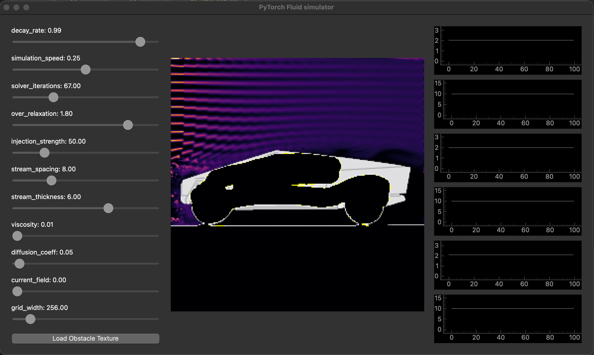

# Fluid simulator program using PyTorch

Steps to take:
```
git clone <repo>
cd <repo>
pip install virtualenv
virtualenv env
source venv/bin/activate
pip install -r requirements.txt
```

And finally 
```
python scripts/qt_window.py
```


